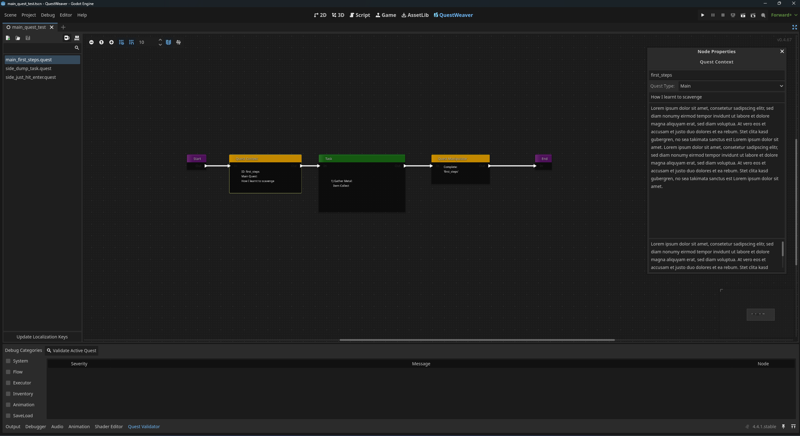

**Quest Weaver** is a powerful, flexible, and node-based quest editor plugin for Godot 4.4+. Designed from the ground up to be both user-friendly for designers and easily extensible for developers, it provides a complete solution for creating complex narratives and dynamic gameplay objectives directly within the Godot editor.

Stop juggling dictionaries and hard-coded logic. Start weaving your story, one node at a time.

## Table of Contents

-   [Why Use Quest Weaver?](#why-qw)
-   [Core Features](#features)
-   [A Tour of the Node System](#a-tour-of-the-node-system)
	-   [Flow Control](#flow-control)
	-   [Logic & Game State](#logic--game-state)
	-   [World Interaction](#world-interaction)
-   [Built-in Tools for a Smooth Workflow](#built-in-tools-for-a-smooth-workflow)
-   [Installation](#installation)
-   [Getting Started](#getting-started)
-   [License](#license)

---

## 🚀 Why use Quest Weaver?

Most quest systems suffer from two major problems: they are rigid (hard to reuse), and they break your save games whenever you update a quest. Quest Weaver solves both.

*   **Production-Ready Architecture:** Built on a strict **Blueprint & Instance** pattern. The quest files (`.quest`) are stateless blueprints. The runtime logic uses lightweight Instances. This ensures high performance and stability.
*   **Save Game Stability:** We separate logic from data. Save files only store pure JSON-compatible state (variables & progress). You can move nodes, rename descriptions, or change logic in the editor **without breaking existing save games**.
*   **Reusability (Templates):** Don't write the same "Fetch Quest" ten times. Write it once, use variables like `{target}` and `{amount}`, and instantiate it infinitely with different parameters.

---

## ✨ Core Features

### 🧠 Logic & Flow
*   **Visual Graph Editor:** Design branching narratives using an intuitive Drag & Drop interface.
*   **Flexible Logic Nodes:** Use **Branches**, **Random Choices**, **Parallel Execution**, and **Synchronization** (Wait for All/Any) to create complex flows.
*   **Sub-Graphs:** Organize huge stories by nesting quests inside other quests. Keep your main graph clean!
*   **Scopes & Loops:** Create repeatable logic sections (e.g. "Try again" loops) with built-in execution limits.

### 🛠️ Parametrization & Templates
*   **Dynamic Variables:** Inject parameters when starting a quest (`start_quest("hunt", {"target": "Wolf"})`).
*   **Text Replacement:** Use placeholders in titles, descriptions, and messages. `{npc_name}` automatically becomes "Gandalf" at runtime.
*   **Dynamic Logic:** Even logic nodes can use variables. Check for `{required_amount}` items instead of a hardcoded number.

### 🔍 Debugging & Validation
*   **Live Debugger:** Watch your quest flow **in real-time**. Active nodes pulse orange, completed nodes turn green, and failed nodes turn red inside the editor while your game runs.
*   **Static Validator:** The built-in validator analyzes your graphs for dead ends, infinite loops, or missing references before you even run the game. click on an error to jump directly to the node.

### 🔗 Integration
*   **Inventory Adapter:** Agnostic design. Connect your existing inventory system via a simple Adapter script to allow "Give/Take/Check Item" nodes.
*   **Localization:** Built-in **Key Scanner**. Scans all your nodes for text and auto-generates/updates a CSV file for Godot's translation system.
*   **Global Events:** Wait for signals like `enemy_killed` or `location_entered` directly in the graph.

## A Tour of the Node System

The heart of Quest Weaver is its rich library of nodes, each performing a specific task. Here are just a few examples:

#### Flow Control

-   **Branch Node:** The core of your narrative choices. It checks a list of conditions (e.g., *Is the player's level > 5? AND Do they have the 'King's Amulet'?*) and routes the quest down a `True` or `False` path.
-   **Parallel Node:** Fire multiple quest branches simultaneously. Send the player to talk to the blacksmith *and* the alchemist at the same time.
-   **Synchronize Node:** Wait for multiple branches to complete before continuing. The gate only opens once the player has spoken to both the blacksmith *and* the alchemist.
-   **Random Node:** Introduce chance into your quests. Will the player find a treasure map or an angry goblin? You decide the odds.

#### Logic & Game State

-   **Quest Context Node:** The entry point of every quest. Define its ID, title, description, and whether it's a main or side quest.
-   **Quest Manipulator Node:** Change the state of other quests. Completing "The Initiation" can automatically start "A New Assignment" or fail "The Rival's Plan".
-   **Set Variable Node:** Modify your game's state directly. Give the player 100 gold, increase their "chaos" stat, or set the `is_bridge_repaired` variable to `true`.

#### World Interaction

-   **Task Node:** The workhorse of your quests. Contains a list of objectives the player must complete, such as `ITEM_COLLECT`, `KILL`, or `INTERACT`.
-   **Give/Take Item Node:** Directly add or remove items from the player's inventory, with success and failure outputs.
-   **Event Listener Node:** Pause the quest until a specific game event occurs, like the player pressing a button or a day/night cycle completing.
-   **Show UI Message Node:** Display animated messages, instructions, or area titles on the screen, with full control over timing and animations.

## Built-in Tools for a Smooth Workflow

-   **Properties Panel:** A clean, context-sensitive UI to edit the properties of any selected node.
-   **Quest Validator:** A dedicated dock that scans your active quest for logical errors, unreachable nodes, and unconfigured properties, letting you jump directly to the problem node.
-   **Localization Scanner:** A one-click tool to scan all your quests for player-facing text and export new keys to a CSV file, ready for translation.

## Installation

1.  Navigate to the **Releases** page on this GitHub repository.
2.  Download the latest `QuestWeaver-vX.X.X.zip` file.
3.  Unzip the file and copy the `addons/quest_weaver` directory into your Godot project's root folder.
4.  In Godot, go to **Project -> Project Settings -> Plugins** and enable the "QuestWeaver" plugin.

## Getting Started

1.  Activate the plugin (see above).
2.  Open the Quest Weaver main view by clicking the "Quest Weaver" tab at the top of the editor.
3.  Use the side panel to create your first new quest file (`*.quest`).
4.  Right-click in the graph editor to add your first node! A good starting point is `Start Node -> Quest Context Node -> End Node`.
5.  Explore the included example scenes and quests in the `addons/quest_weaver/examples` directory to see it in action.

## 💬 Support & Community

Join the Discord server to ask questions, suggest features, or show off your projects made with this addon!

 

## License

This project is licensed under the MIT License - see the [LICENSE](LICENSE) file for details.
